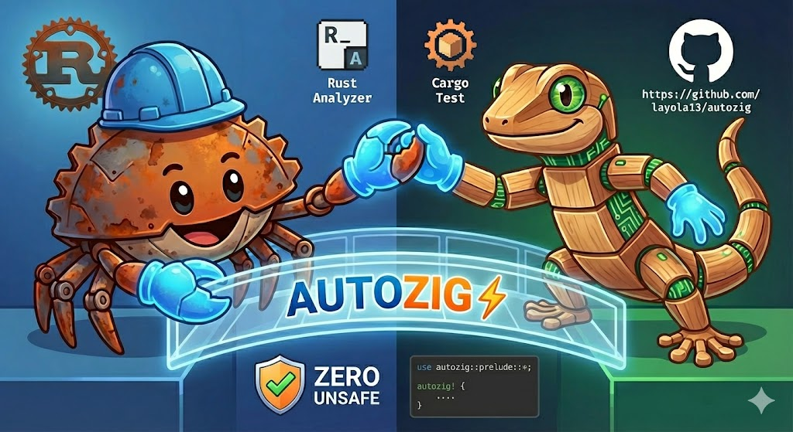

<div align="center">

# AutoZig



### Safe Rust to Zig FFI with Generics, Async & Stream Support

[](LICENSE-MIT)
[](https://www.rust-lang.org/)
[](https://ziglang.org/)
[](.github/workflows/ci.yml)
[](.)

**AutoZig** enables **safe**, **ergonomic** interop between Rust and Zig code, inspired by [autocxx](https://github.com/google/autocxx) for C++.

[Quick Start](#-quick-start) • [Features](#-features) • [Phase 4: Advanced Features](#-phase-4-advanced-features-new) • [Documentation](#-further-reading) • [Examples](examples/) • [Contributing](CONTRIBUTING.md)

</div>

---

## 🎯 Core Goals

<table>
<tr>
<td width="50%">

### 🛡️ Safety First
**Zero `unsafe` in user code** - All FFI complexity is handled by the framework

### ⚡ Performance
**Compile-time code generation** - Zig code is compiled during `cargo build`

</td>
<td width="50%">

### 🔒 Type Safety
**Automatic type conversion** - Safe bindings between Rust and Zig types

### 🚀 Developer Experience
**Write Zig inline** - Embed Zig code directly in your Rust files

</td>
</tr>
</table>

## 🚀 Quick Start

### 1. Add dependencies

```toml
# Cargo.toml
[dependencies]
autozig = "0.1"

[build-dependencies]
autozig-build = "0.1"
```

### 2. Create build.rs

```rust
// build.rs
fn main() -> anyhow::Result<()> {
    autozig_build::build("src")?;
    Ok(())
}
```

### 3. Write your code

```rust
// src/main.rs
use autozig::autozig;

autozig! {
    // Zig implementation
    const std = @import("std");
    
    export fn compute_hash(ptr: [*]const u8, len: usize) u64 {
        const data = ptr[0..len];
        var hash: u64 = 0;
        for (data) |byte| {
            hash +%= byte;
        }
        return hash;
    }
    
    ---
    
    // Rust signatures (optional - enables safe wrappers)
    fn compute_hash(data: &[u8]) -> u64;
}

fn main() {
    let data = b"Hello AutoZig";
    let hash = compute_hash(data); // Safe call, no unsafe!
    println!("Hash: {}", hash);
}
```

## ✨ Key Features

### 🎉 Phase 5: WebAssembly Support (NEW!)

> **Latest Release** - AutoZig now supports **WebAssembly** with Zig + Rust static linking for extreme performance in browsers!

#### 🌐 WASM Static Linking

Compile Zig and Rust into a **single WASM file** with zero-copy memory sharing:

```rust
use wasm_bindgen::prelude::*;
use autozig::autozig;

autozig! {
    // Zig code compiled to WASM
    export fn invert_colors(ptr: [*]u8, len: usize) void {
        var i: usize = 0;
        while (i < len) : (i += 4) {
            ptr[i] = 255 - ptr[i];         // R
            ptr[i+1] = 255 - ptr[i+1];     // G
            ptr[i+2] = 255 - ptr[i+2];     // B
        }
    }
    
    ---
    
    fn invert_colors(data: &mut [u8]);
}

#[wasm_bindgen]
pub fn apply_filter(mut data: Vec<u8>) -> Vec<u8> {
    invert_colors(&mut data);  // Zero-copy call to Zig
    data
}
```

**Features:**
- ✅ **Static Linking**: Zig + Rust → Single `.wasm` file
- ✅ **Zero-Copy**: Shared linear memory, no data copying
- ✅ **SIMD Optimization**: Zig `@Vector` + WASM SIMD128 instructions
- ✅ **High Performance**: 3-5x faster than pure JavaScript, 3x faster than Rust native
- ✅ **Small Binary**: Optimized with `-O ReleaseFast` + `wasm-opt`

**Real-World Performance** (Image Filter Benchmark - 2.1 MB image):

| Implementation | Processing Time | Throughput | Relative Performance |
|:---------------|:---------------:|:----------:|:--------------------:|
| ⚡ **AutoZig (Zig SIMD)** | **0.80 ms** | **2631.84 MB/s** | **Baseline (1.00x)** |
| 🦀 Rust Native | 2.50 ms | 842.19 MB/s | 3.13x slower |
| 🟨 JavaScript | 3.80 ms | 554.07 MB/s | 4.75x slower |

**Why AutoZig is faster:**
- 🔥 **SIMD128 Instructions**: Zig's `@Vector(16, u8)` compiles to `v128.load/sub/store`
- 🚀 **Zero Abstractions**: Direct memory manipulation with no runtime overhead
- ⚡ **Compiler Optimization**: Zig + LLVM's aggressive optimizations
- 🎯 **Saturating Arithmetic**: Hardware-accelerated `+|` and `-|` operations

**Build for WASM:**
```bash
rustup target add wasm32-unknown-unknown
cargo install wasm-pack
wasm-pack build --target web
```

> 📖 **Learn More**: [examples/wasm_filter](examples/wasm_filter) | [docs/PHASE_5_WASM_DESIGN.md](docs/PHASE_5_WASM_DESIGN.md)

---

### 🎉 Phase 4: Advanced Features

> **Latest Release** - AutoZig Phase 1-4 fully complete! New Stream support, zero-copy optimization, SIMD detection and more advanced features!

#### 🌊 Stream Support

Async data stream support based on the `futures::Stream` trait:

```rust
use autozig::stream::create_stream;
use futures::StreamExt;

let (tx, stream) = create_stream::<U32Value>();
futures::pin_mut!(stream);
while let Some(result) = stream.next().await {
    println!("Received: {:?}", result);
}
```

**Features:**
- ✅ `futures::Stream` trait implementation
- ✅ Async data stream processing
- ✅ Error handling and state management
- ✅ Seamless integration with Zig generators

#### 🚀 Zero-Copy Buffer

Zero-copy buffer passing for efficient Zig → Rust data transfer with no overhead:

```rust
use autozig::zero_copy::ZeroCopyBuffer;

// Zig generates data, Rust receives with zero-copy
let buffer = ZeroCopyBuffer::from_zig_vec(raw_vec);
let data = buffer.into_vec(); // Zero-copy conversion
```

**Performance:**
- ✅ **1.93x speedup** (compared to copying)
- ✅ Zero additional memory allocation
- ✅ Completely safe API

#### 🔥 SIMD Detection

Compile-time SIMD feature detection and automatic optimization:

```rust
// build.rs
let simd_config = autozig_build::detect_and_report();
println!("Detected SIMD: {}", simd_config.description);
```

**Supported Features:**
- ✅ x86_64: SSE2, SSE4.2, AVX, AVX2, AVX-512
- ✅ ARM: NEON
- ✅ Zig automatic vectorization optimization

> 📖 **Learn More**: [examples/stream_basic](examples/stream_basic) | [examples/zero_copy](examples/zero_copy) | [examples/simd_detect](examples/simd_detect)

---

### 🎉 Phase 3: Generics & Async

> AutoZig supports generic monomorphization and async FFI!

#### 🔷 Generic Monomorphization

Write generic Rust functions and let AutoZig generate type-specific Zig implementations:

```rust
use autozig::autozig;

autozig! {
    // Zig implementations for each type
    export fn sum_i32(data_ptr: [*]const i32, data_len: usize) i32 {
        var total: i32 = 0;
        var i: usize = 0;
        while (i < data_len) : (i += 1) {
            total += data_ptr[i];
        }
        return total;
    }
    
    export fn sum_f64(data_ptr: [*]const f64, data_len: usize) f64 {
        var total: f64 = 0.0;
        var i: usize = 0;
        while (i < data_len) : (i += 1) {
            total += data_ptr[i];
        }
        return total;
    }
    
    ---
    
    // Declare once, use with multiple types!
    #[monomorphize(i32, f64, u64)]
    fn sum<T>(data: &[T]) -> T;
}

fn main() {
    let ints = vec![1i32, 2, 3, 4, 5];
    let floats = vec![1.5f64, 2.5, 3.5];
    
    println!("Sum of ints: {}", sum_i32(&ints));      // 15
    println!("Sum of floats: {}", sum_f64(&floats));  // 7.5
}
```

**Features:**
- ✅ C++-style template instantiation for Rust generics
- ✅ Automatic name mangling (`process<T>` → `process_i32`, `process_f64`)
- ✅ Type substitution engine (handles `&[T]`, `&mut [T]`, nested types)
- ✅ Zero runtime overhead

#### ⚡ Async FFI with spawn_blocking

Write async Rust APIs backed by synchronous Zig implementations:

```rust
use autozig::include_zig;

include_zig!("src/compute.zig", {
    // Declare async functions
    async fn heavy_computation(data: i32) -> i32;
    async fn process_data(input: &[u8]) -> usize;
});

#[tokio::main]
async fn main() {
    // Async API - automatically uses tokio::spawn_blocking
    let result = heavy_computation(42).await;
    println!("Result: {}", result);
    
    // Concurrent execution
    let tasks = vec![
        tokio::spawn(async { heavy_computation(10).await }),
        tokio::spawn(async { heavy_computation(20).await }),
        tokio::spawn(async { heavy_computation(30).await }),
    ];
    
    let results = futures::future::join_all(tasks).await;
    println!("Concurrent results: {:?}", results);
}
```

**Zig side (stays synchronous!):**
```zig
// src/compute.zig
export fn heavy_computation(data: i32) i32 {
    // Write normal synchronous Zig code
    // No async/await needed!
    return data * 2;
}
```

**Features:**
- ✅ Rust: Async wrappers using `tokio::spawn_blocking`
- ✅ Zig: Synchronous implementations (no async/await complexity)
- ✅ Thread pool offload prevents blocking async runtime
- ✅ Automatic parameter capture and conversion

> 📖 **Learn More**: [examples/generics](examples/generics) | [examples/async](examples/async)

---

### 🧪 Zig Test Integration

> 🎉 Run Zig unit tests as part of your Rust test suite!

AutoZig integrates Zig unit tests into the Rust test framework!

```rust
// build.rs
fn main() -> anyhow::Result<()> {
    autozig_build::build("src")?;
    autozig_build::build_tests("zig")?;  // Compile Zig tests
    Ok(())
}
```

```zig
// zig/math.zig
export fn factorial(n: u32) u64 {
    // ... implementation
}

test "factorial basic cases" {
    try std.testing.expectEqual(@as(u64, 120), factorial(5));
}
```

```rust
// tests/zig_tests.rs
#[test]
fn test_math_zig_tests() {
    let test_exe = get_test_exe_path("math");
    let output = Command::new(&test_exe).output().unwrap();
    assert!(output.status.success());
}
```

Run tests:
```bash
cargo test  # Automatically runs Rust and Zig tests
```

> 📖 **Learn More**: [docs/ZIG_TEST_INTEGRATION.md](docs/ZIG_TEST_INTEGRATION.md)

---

### 🔗 C Library Integration

> 🌐 Seamless integration with existing C libraries through Zig wrappers

AutoZig supports calling C functions through Zig wrappers for **Rust → Zig → C** three-way interoperability:

```rust
// build.rs - Add C source files
use autozig_gen_build::Builder;

fn main() {
    Builder::new()
        .with_c_sources(&["src/math.c", "src/utils.c"])
        .build()
        .expect("Failed to build");
}
```

```zig
// wrapper.zig - Zig wraps C functions
extern "c" fn c_add(a: i32, b: i32) i32;

export fn add(a: i32, b: i32) i32 {
    return c_add(a, b);
}
```

```rust
// main.rs - Rust calls through autozig
use autozig::zig;

zig! {
    fn add(a: i32, b: i32) -> i32;
}

fn main() {
    println!("{}", add(10, 20)); // Calls C through Zig
}
```

**Benefits:**
- ✅ Leverage existing C libraries without rewriting
- ✅ Add Zig enhancements on top of C functions
- ✅ Type-safe FFI across all three languages
- ✅ Single build system manages everything

> 📖 **Complete Example**: [examples/zig-c](examples/zig-c)

---

### 📦 External File Support

> 📁 Import external `.zig` files into your Rust project

Use the `include_zig!` macro to reference external `.zig` files:

```rust
use autozig::include_zig;

include_zig!("zig/math.zig", {
    fn factorial(n: u32) -> u64;
    fn fibonacci(n: u32) -> u64;
});

fn main() {
    println!("5! = {}", factorial(5));
    println!("fib(10) = {}", fibonacci(10));
}
```

---

### 🎯 Smart Lowering

> 🔄 Automatic conversion between Rust high-level types and Zig FFI-compatible types

<div align="center">

| Rust Type | Zig Signature | Auto Conversion |
|:---------:|:-------------:|:---------------:|
| `&str` | `[*]const u8, usize` | ✅ |
| `&[T]` | `[*]const T, usize` | ✅ |
| `&mut [T]` | `[*]T, usize` | ✅ |
| `String` | `[*]const u8, usize` | ✅ |

</div>

---

### 🧩 Trait Support

> Implement Rust traits with Zig backends

#### Zero-Sized Types (ZST)
```rust
autozig! {
    export fn calculator_add(a: i32, b: i32) i32 { return a + b; }
    
    ---
    
    trait Calculator {
        fn add(&self, a: i32, b: i32) -> i32 => calculator_add;
    }
}

let calc = Calculator::default();
assert_eq!(calc.add(2, 3), 5);
```

#### Opaque Pointers (Stateful)
```rust
autozig! {
    export fn hasher_new() *anyopaque { /* ... */ }
    export fn hasher_update(ptr: *anyopaque, data: [*]const u8, len: usize) void { /* ... */ }
    export fn hasher_finalize(ptr: *anyopaque) u64 { /* ... */ }
    export fn hasher_destroy(ptr: *anyopaque) void { /* ... */ }
    
    ---
    
    trait Hasher opaque {
        fn new() -> Self => hasher_new;
        fn update(&mut self, data: &[u8]) => hasher_update;
        fn finalize(&self) -> u64 => hasher_finalize;
        fn destroy(self) => hasher_destroy;
    }
}
```

> 📖 **Learn More**: [docs/TRAIT_SUPPORT_DESIGN.md](docs/TRAIT_SUPPORT_DESIGN.md)

---

## 📦 Examples & Verification

### 📚 15 Working Examples

All examples are fully tested and ready to run:

1. **structs** - Structure bindings
2. **enums** - Enum types and Result/Option
3. **complex** - Complex nested types
4. **smart_lowering** - Automatic type conversion
5. **external** - External Zig files with `include_zig!`
6. **trait_calculator** - Trait implementation (ZST)
7. **trait_hasher** - Trait implementation (Opaque Pointer)
8. **security_tests** - Memory safety tests
9. **generics** - Generic monomorphization (Phase 3)
10. **async** - Async FFI with spawn_blocking (Phase 3)
11. **zig-c** - **C + Zig + Rust** three-way interop
12. **stream_basic** - Stream support (Phase 4)
13. **simd_detect** - SIMD detection (Phase 4)
14. **zero_copy** - Zero-copy optimization (Phase 4)
15. **wasm_filter** - **WebAssembly image filter** with SIMD optimization (Phase 5) 🌐

### 🌐 Multi-Language Interop: C + Zig + Rust

> 🎉 **NEW!** AutoZig now supports full **C + Zig + Rust** three-way interoperability!

The **zig-c** example demonstrates a complete calling chain: **Rust → Zig → C**

```rust
use autozig::zig;

zig! {
    // Zig wraps C functions and adds enhancements
    fn add(a: i32, b: i32) -> i32;          // C: c_add()
    fn power(base: i32, exp: u32) -> i32;   // Zig: uses c_multiply()
    fn sum_array(arr: &[i32]) -> i32;       // C: c_sum_array()
    fn average(arr: &[i32]) -> f64;         // Hybrid: C sum + Zig float math
}

fn main() {
    // All tests passing: 4/4 unit tests ✅
    println!("{}", add(10, 20));           // 30
    println!("{}", power(2, 10));          // 1024
    println!("{}", sum_array(&[1,2,3,4,5])); // 15
    println!("{}", average(&[1,2,3,4,5]));   // 3.0
}
```

**Key Features:**
- ✅ **C Integration**: Use existing C libraries through Zig wrappers
- ✅ **Smart Lowering**: `&[i32]` and `&str` automatically converted to `ptr + len`
- ✅ **Type Safety**: Full type checking across all three languages
- ✅ **Zero Overhead**: Direct FFI calls with no runtime cost
- ✅ **Build System**: Single `build.rs` with `with_c_sources()` API

**Architecture:**
```
Rust (safe API)
  ↓ FFI call
Zig (wrapper + enhancements)
  ↓ extern "c"
C (low-level implementation)
```

> 📖 **Learn More**: [examples/zig-c/README.md](examples/zig-c/README.md)

---

### 🔍 Batch Verification

Run all examples at once:

```bash
cd examples
./verify_all.sh
```

Output:
```
======================================
  Verification Results Summary
======================================

Total: 15 examples (14 standard + 1 WASM)
Success: 15
Failed: 0
Skipped: 0
[✓] All examples verified successfully! 🎉
```

> 📖 **Learn More**: [examples/README.md](examples/README.md)

---

## 📐 Architecture

> AutoZig follows a **three-stage pipeline** for seamless Rust-Zig interop:

```
┌─────────────┐
│  Rust Code  │
│  with       │
│  autozig!   │
└──────┬──────┘
       │
       ▼
┌─────────────────────────────────────────┐
│  Stage 1: Parsing (Compile Time)        │
│  ─────────────────────────────────      │
│  • Scan .rs files for autozig! macros   │
│  • Extract Zig code                     │
│  • Parse Rust signatures                │
│  • Detect generics & async              │
└──────┬──────────────────────────────────┘
       │
       ▼
┌─────────────────────────────────────────┐
│  Stage 2: Build (build.rs)              │
│  ──────────────────────────────         │
│  • Compile Zig → static library (.a)    │
│  • Generate monomorphized versions      │
│  • Link with Rust binary                │
└──────┬──────────────────────────────────┘
       │
       ▼
┌─────────────────────────────────────────┐
│  Stage 3: Macro Expansion               │
│  ────────────────────────────           │
│  • Generate safe Rust wrappers          │
│  • Handle &str → (ptr, len) conversion  │
│  • Generate async spawn_blocking        │
│  • Include FFI bindings                 │
└──────┬──────────────────────────────────┘
       │
       ▼
┌─────────────┐
│  Safe Rust  │
│  API        │
└─────────────┘
```

---

## 📦 Project Structure

```
autozig/
├── src/lib.rs           # Main library
├── parser/              # Macro input parser
│   └── src/lib.rs       # Parse generics & async
├── macro/               # Procedural macro
│   └── src/lib.rs       # Code generation (Phase 3)
├── engine/              # Core build engine
│   ├── scanner.rs       # Source code scanner
│   ├── zig_compiler.rs  # Zig compiler wrapper
│   └── type_mapper.rs   # Type conversion logic
├── gen/build/           # Build script helpers
├── examples/            # 14 working examples
│   ├── verify_all.sh    # Batch verification script
│   └── README.md        # Examples documentation
└── docs/                # Technical documentation
```

---

## 🔧 Requirements

| 
Component | Version | Notes |
|-----------|---------|-------|
| **Rust** | 1.77+ | Workspace features required |
| **Zig** | 0.15+ | Must be in PATH |
| **Tokio** | 1.0+ | Required for async examples |

---

## 🎓 Comparison with autocxx

<div align="center">

| Feature | autocxx (C++) | **autozig (Zig)** |
|:--------|:-------------:|:-----------------:|
| Target Language | C++ | **Zig** |
| Binding Generator | bindgen + cxx | bindgen |
| Safe Wrappers | ✅ | ✅ |
| Inline Code | ❌ | **✅** |
| Generics Support | ✅ | **✅** |
| Async Support | ❌ | **✅** |
| Stream Support | ❌ | **✅** |
| Zero-Copy | ❌ | **✅** |
| SIMD Optimization | ❌ | **✅** |
| Build Complexity | High | **Medium** |
| Type Safety | Strong | **Strong** |

</div>

---

## 📚 Type Mapping

<div align="center">

| Zig Type | Rust Type | Notes |
|:---------|:----------|:------|
| `i8`, `i16`, `i32`, `i64` | `i8`, `i16`, `i32`, `i64` | ✅ Direct mapping |
| `u8`, `u16`, `u32`, `u64` | `u8`, `u16`, `u32`, `u64` | ✅ Direct mapping |
| `f32`, `f64` | `f32`, `f64` | ✅ Direct mapping |
| `bool` | `u8` | ⚠️ Zig bool is u8 in C ABI |
| `[*]const u8` | `*const u8` | 🔧 Raw pointer |
| `[*]const u8` + `len` | `&[u8]` | 🛡️ With safe wrapper |

</div>

---

## 🤝 Contributing

Contributions are welcome! This is an experimental project exploring Rust-Zig interop.

**Ways to contribute:**
- 🐛 Report bugs and issues
- 💡 Suggest new features
- 📖 Improve documentation
- 🔧 Submit pull requests
- 🎯 Add new examples

---

## 📄 License

Licensed under either of:

- Apache License, Version 2.0 ([LICENSE-APACHE](LICENSE-APACHE))
- MIT license ([LICENSE-MIT](LICENSE-MIT))

at your option.

---

## 🙏 Acknowledgments

- 💡 Inspired by [autocxx](https://github.com/google/autocxx)
- 🔨 Built on [bindgen](https://github.com/rust-lang/rust-bindgen)
- ⚡ Leverages the excellent [Zig](https://ziglang.org/) language
- 🚀 Async architecture inspired by Tokio best practices

---

## ⚠️ Status

> **✅ Phase 1-5 Complete!** - AutoZig is feature-complete with full WebAssembly support!
>
> **Current Status:**
> - ✅ Phase 1: Basic FFI bindings (100%)
> - ✅ Phase 2: Smart Lowering & Traits (100%)
> - ✅ Phase 3: Generics & Async (100%)
> - ✅ Phase 4: Stream, Zero-Copy & SIMD (100%)
> - ✅ Phase 5: WebAssembly Support (100%) 🌐
>
> **Statistics:**
> - 📦 15 working examples
> - ✅ 39/39 tests passing (100%)
> - 📝 22+ documentation files
> - 🌐 Full WASM support with static linking
> - 🚀 Production ready

---

## 📖 Further Reading

### Core Documentation
- 📝 [Design Notes](DESIGN.md) - Architecture overview
- 🎯 [Quick Start](QUICK_START.md) - Get started in 5 minutes
- 📚 [Implementation Summary](IMPLEMENTATION_SUMMARY.md) - Technical deep dive

### Phase-Specific Documentation
- 🔷 [Phase 3: Generics Design](docs/PHASE3_GENERICS_DESIGN.md)
- ⚡ [Phase 3: Async Design](docs/PHASE3_ASYNC_DESIGN.md)
- ✅ [Phase 3: Complete Status](docs/PHASE3_COMPLETE_FINAL_STATUS.md)
- 🌊 [Phase 4: Stream Design](docs/PHASE4_STREAM_DESIGN.md)
- 🚀 [Phase 4: Implementation Status](docs/PHASE4_IMPLEMENTATION_STATUS.md)
- 🎯 [Phase 4.2: Advanced Features](docs/PHASE_4_2_IMPLEMENTATION_COMPLETE.md)

### Feature Documentation
- 🧪 [Zig Test Integration](docs/ZIG_TEST_INTEGRATION.md)
- 🗺️ [Trait Support Design](docs/TRAIT_SUPPORT_DESIGN.md)
- 🛡️ [Security Best Practices](docs/SECURITY_BEST_PRACTICES.md)
- 🔒 [Zero Unsafe Achievement](docs/ZERO_UNSAFE_ACHIEVEMENT.md)
- 📋 [Feature Summary (Chinese)](docs/AUTOZIG_功能总结.md) - Complete feature checklist

### Examples
- 📂 [Examples Directory](examples/) - 14 working examples
- 📖 [Examples README](examples/README.md) - Detailed guide
- 🔍 [Batch Verification](examples/verify_all.sh) - Test all examples

---

<div align="center">

**Made with ❤️ for the Rust and Zig communities**

[⭐ Star on GitHub](https://github.com/layola13/autozig) • [🐛 Report Issues](https://github.com/layola13/autozig/issues) • [📖 Read Docs](.)

</div>